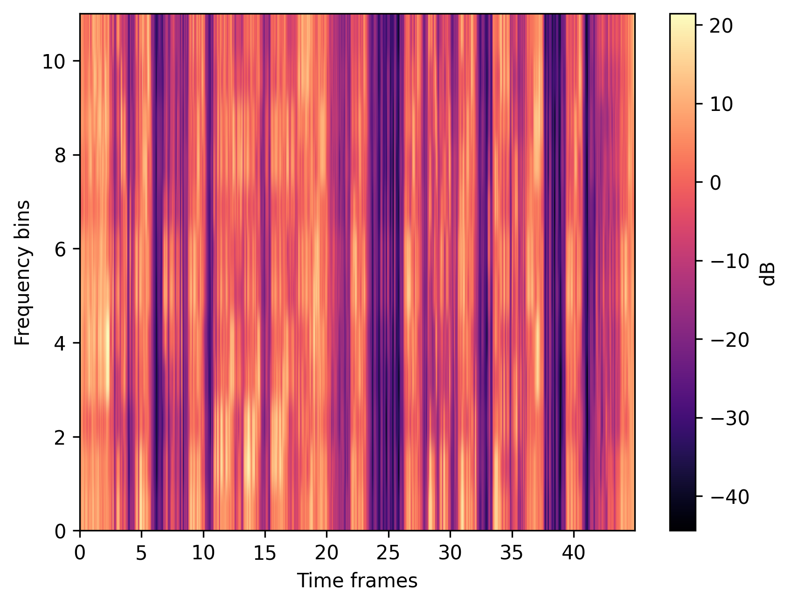
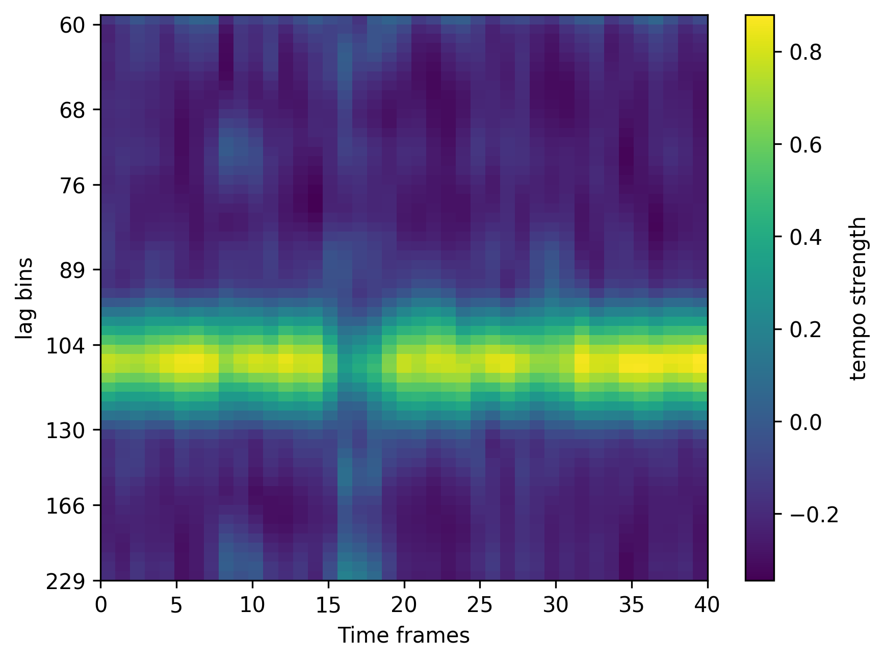
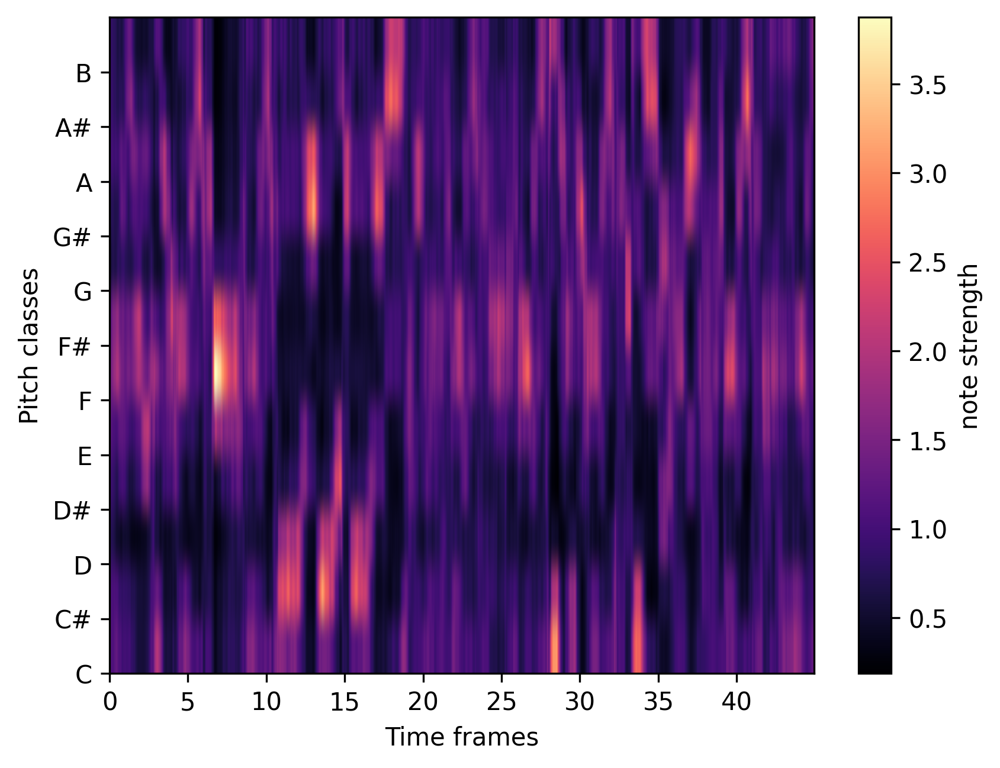
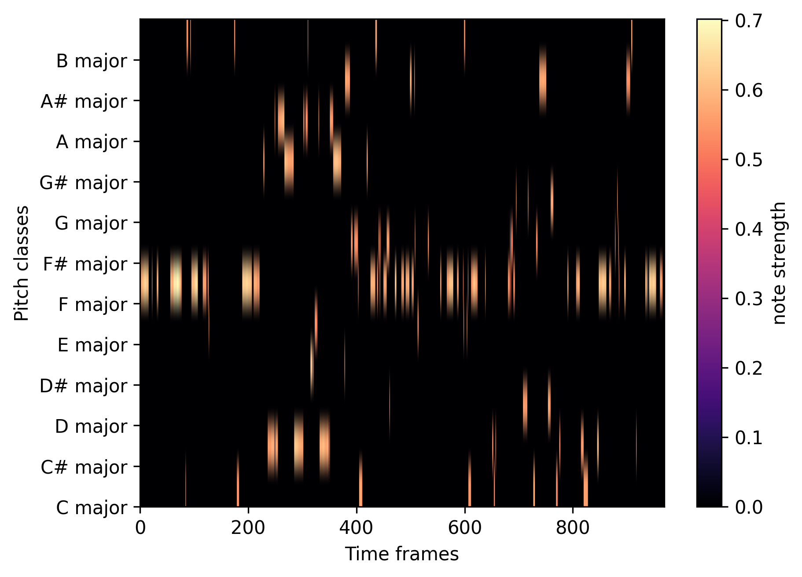
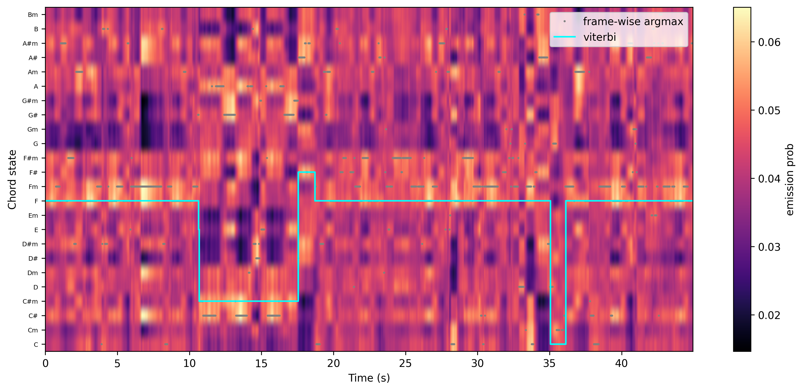

# Music Audio Analysis Toolkit

A from-scratch digital signal processing pipeline that estimates tempo (BPM) and recognizes chords directly from raw audio — built on top of low-level FFT/CQT primitives rather than a pre-built beat-tracking or chord-recognition library.

Given an audio file, the tool can:
- Estimate BPM using framed FFT analysis, multi-band onset detection, autocorrelation, and harmonic scoring
- Recognize chords over time using either an STFT-based or a CQT-based chromagram, template matching against major/minor chord profiles, and HMM/Viterbi decoding to smooth the result into a musically coherent chord sequence

The goal of this project was to understand *why* these techniques work, not just call a library function — every stage below (spectrogram, onset curve, autocorrelation, chromagram, template matching, Viterbi) is implemented from first principles using NumPy/SciPy, with `librosa` used only for audio I/O, CQT, and harmonic/percussive source separation.

## Example output

**Spectrogram** — magnitude spectrum from a manually framed and windowed FFT:



**Tempogram** — tempo-strength across sliding windows, used to cross-check the single-shot autocorrelation BPM estimate:



**Chromagram** — 12 pitch-class energy over time, built from a tuning-corrected CQT:



**Chord template scores** — cosine similarity between the chromagram and 24 major/minor chord templates:



**Viterbi-decoded chord sequence** — raw per-frame chord guesses (gray) vs. the HMM/Viterbi-smoothed path (cyan), which removes the frame-to-frame flicker of picking the frame-wise best match independently:



## How it works

**1. Spectrogram (`components/spectrogram.py`)**
Audio is loaded and manually split into overlapping frames (`librosa.util.frame`, 50ms window / 12.5ms hop). Each frame is Hann-windowed and passed through `numpy.fft.rfft`, and the squared magnitudes are stacked into a spectrogram — no `librosa.stft` shortcut.

**2. BPM estimation (`components/bpm_estimation.py`, `estimation.py`, `novelty_curve.py`)**
The spectrogram is split into frequency bands (`frequency_ranges.py`: sub-bass, bass, mid, presence, brilliance, etc.). Each band's energy is differentiated and half-wave rectified into an onset/novelty curve, then smoothed. Autocorrelation over a plausible BPM range (60–220 BPM) surfaces candidate periodicities; a harmonic-scoring pass re-weights each candidate by summing its half/double/triple/quadruple-tempo bins, which resolves the classic autocorrelation failure mode of locking onto a tempo octave (e.g. picking 60 BPM when the track is actually 120). A tempogram — autocorrelation recomputed over a sliding window across the whole track — cross-validates that the tempo estimate is stable rather than a one-off peak.

Validated against `librosa.beat.beat_track` on synthetic click tracks with exactly known ground-truth tempo (`scripts/benchmark_bpm.py`): mean absolute error of **1.0 BPM** across 70–175 BPM, vs. 1.67 BPM for librosa on the same signals. An earlier version of the harmonic-scoring weights had a real octave-lock bug in the 128–176 BPM range (traced, reproduced, and fixed — see `tests/test_estimation.py::test_bpm_pipeline_does_not_lock_onto_octave_alias` for the regression test).

**3. Chord recognition — two front ends**
- *STFT path* (`note_detection/note_detection.py: stft_chord_analyzer`): folds the linear-frequency spectrogram into 12 pitch classes by mapping each FFT bin to its nearest MIDI pitch class (`note_detection/detection_tools.py`), producing a chromagram directly from the STFT.
- *CQT path* (`cqt_chord_analyzer`): applies harmonic/percussive source separation, estimates the track's tuning offset, and computes a tuning-corrected Constant-Q Transform. The CQT bins are folded into a 12-bin chromagram with a tunable bass/treble weighting, which tends to track chord roots more cleanly than the STFT path.

**4. Template matching (`note_detection/detection_tools.py`)**
The chromagram is compared against 24 hand-built chord templates (major and minor triads in all 12 keys, rotated from a base template) via cosine similarity. Templates for 7th chords are stubbed in but currently commented out — see Roadmap.

**5. Temporal smoothing (`note_detection/hmm_viterbi.py`, `ssm.py`, `adjustments.py`)**
Raw per-frame template-match scores are noisy — a chord can flicker between two guesses frame to frame even mid-chord. Two smoothing strategies are implemented:
- A self-similarity matrix with diagonal smoothing, to visualize repeated song sections independent of chord labels.
- An HMM/Viterbi decoder over the 24 major/minor chord states, using a transition matrix (`transmission/transition_matrix.npy`) with a strong self-transition prior and off-diagonal transition probabilities derived from real chord-progression statistics (extracted from the McGill Billboard corpus), so the decoded path favors chord changes that actually occur in real songs rather than arbitrary jumps.

## Project structure

```
BPM_estimation_proj/
├── music/                          # input audio files go here
├── charts/                         # generated visualizations land here
├── transmission/
│   └── transition_matrix.npy       # chord transition probabilities for Viterbi
└── src/
    ├── main.py                     # CLI entry point
    └── components/
        ├── spectrogram.py          # framed FFT → magnitude spectrum
        ├── frequency_ranges.py     # splits spectrum into named frequency bands
        ├── novelty_curve.py        # onset curve + smoothing
        ├── estimation.py           # autocorrelation, harmonic scoring, tempogram
        ├── visualization.py        # all chart generation (matplotlib)
        └── note_detection/
            ├── note_detection.py   # STFT and CQT chord analysis pipelines
            ├── detection_tools.py  # pitch-class folding, chord templates, matching
            ├── hmm_viterbi.py      # emission scoring + Viterbi decoding
            ├── ssm.py              # self-similarity matrix
            └── adjustments.py      # median/diagonal smoothing, downsampling
```

## Setup

```bash
cd BPM_estimation_proj
pip install -r requirements.txt
```

For running the test suite / benchmark script, install dev dependencies instead: `pip install -r requirements-dev.txt`.

## Usage

1. Drop an audio file into `BPM_estimation_proj/music/`
2. From `BPM_estimation_proj/`, run:
   ```bash
   python -m src.main
   ```
3. Enter the filename when prompted, then choose:
   - `1` for BPM estimation
   - `2` for chord analysis (then `1` for CQT or `2` for STFT)
4. Generated charts are saved to `BPM_estimation_proj/charts/`

## Testing & validation

```bash
cd BPM_estimation_proj
pip install -r requirements-dev.txt
pytest -v
```

51 tests cover every DSP module individually (spectrogram, frequency bands, onset curve, autocorrelation/harmonic scoring/tempogram, chord templates, Viterbi decoding, adjustments, self-similarity matrix) plus end-to-end recovery of known tempos from synthetic click tracks.

`python scripts/benchmark_bpm.py` runs a head-to-head comparison against `librosa.beat.beat_track` on synthetic click tracks spanning 70–175 BPM and saves a chart to `charts/bpm_baseline_comparison.png`.

## Roadmap

Known gaps, in priority order:
- **Pure functions + CLI:** `bpm_estimation` and the chord analyzers currently mix computation with `print`/`input` calls. Planned refactor separates computation into pure functions returning values, with I/O (including the interactive prompts above) moved to `main.py`, and an `argparse`-based CLI as an alternative to the interactive loop.
- **CI:** GitHub Actions workflow to run the test suite on push.
- **7th-chord templates:** dominant 7th, minor 7th, and major 7th templates are already stubbed into `chord_templates()` but commented out pending accuracy validation against the triad-only baseline.
- **Cleanup:** remove leftover debug `print` statements, dead/commented code, and inconsistent naming across modules.
- **Tempogram octave bias:** `tempogram()`'s sliding-window harmonic scoring uses the same weighting as the single-shot estimator but over much shorter windows, and hasn't been benchmarked the way the main estimator has — worth auditing for the same class of bias.
